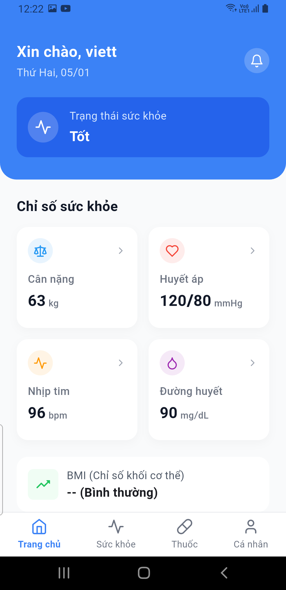
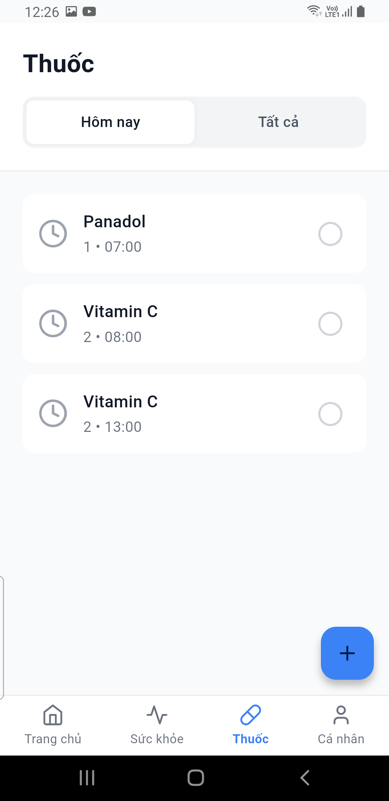
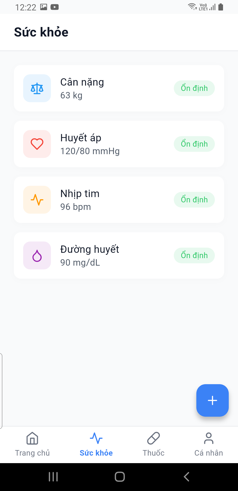
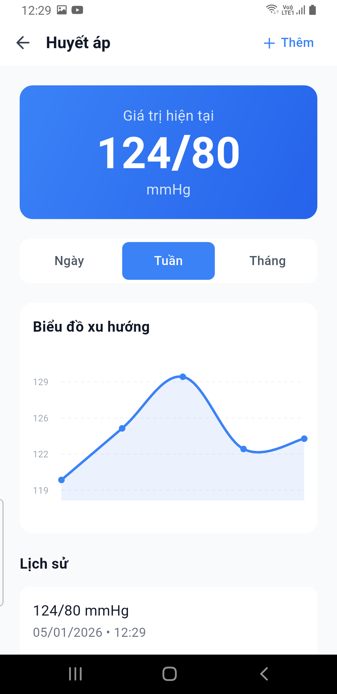
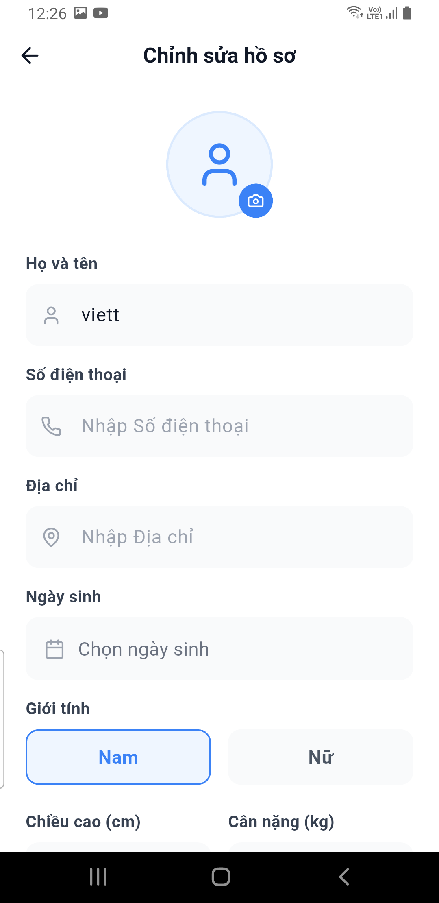
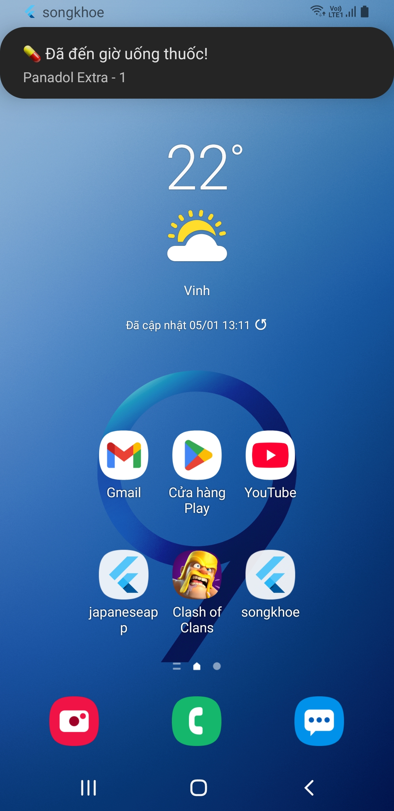

# Sức Khỏe Plus 🏥

## 🌟 Tính năng chính

### 1. Quản lý thuốc & Nhắc nhở 💊
- **Thêm thuốc mới:** Nhập tên thuốc, liều lượng, tần suất uống.
- **Lịch nhắc nhở:** Đặt nhiều mốc giờ uống thuốc trong ngày.
- **Thông báo (Notification):** Hệ thống thông báo cục bộ nhắc nhở chính xác giờ uống thuốc ngay cả khi tắt ứng dụng.

### 2. Theo dõi chỉ số sức khỏe 📈
- **Đa dạng chỉ số:** Hỗ trợ theo dõi Cân nặng, Huyết áp (Tâm thu/Tâm trương), Nhịp tim, Đường huyết.
- **Biểu đồ trực quan:** Sử dụng biểu đồ đường (Line Chart) để hiển thị xu hướng sức khỏe theo tuần/tháng.
- **Nhập liệu thủ công:** Dễ dàng thêm kết quả đo mới với ngày giờ cụ thể.
- **Nhắc đo chỉ số:** Hệ thống thông báo cục bộ nhắc nhở chính xác giờ uống thuốc ngay cả khi tắt ứng dụng.

### 3. Trang chủ & Hồ sơ cá nhân 👤
- **Tổng quan:** Xem nhanh chỉ số sức khỏe mới nhất, tiến độ uống thuốc trong ngày tại màn hình Trang chủ.
- **Hồ sơ:** Quản lý thông tin cá nhân, cài đặt ứng dụng cơ bản.

### 4. Hệ thống & Bảo mật 🔐
- **Xác thực:** Đăng nhập, Đăng ký, Quên mật khẩu qua Firebase Auth.
- **Lưu trữ:** Dữ liệu được đồng bộ hóa thời gian thực trên Cloud Firestore.
- **Cấu hình:** Tùy chỉnh bật/tắt âm thanh, rung cho thông báo.

## 📸 Demo Ứng dụng

| **Trang chủ** | **Quản lý Thuốc** | **Sức khỏe** |
|:-------------:|:-----------------:|:------------:|
|  |  |  |

| **Biểu đồ** | **Cá nhân** | **Thông báo**|
|:-----------:|:-----------:|:-----------:|
|  |  |   |
